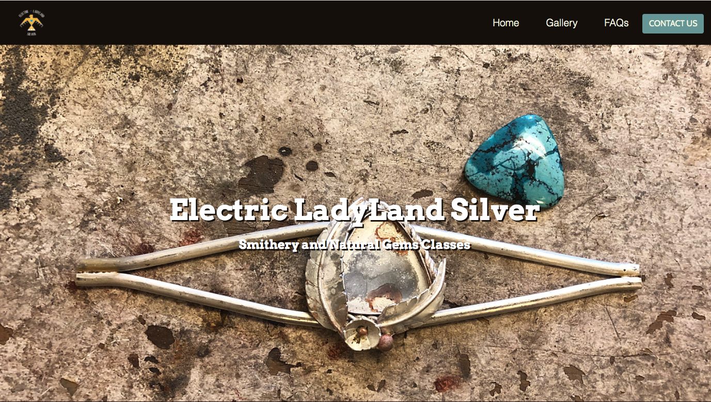

# Electric LadyLand Silver #
---

## Contents ##
---

* UX
    * Project Goals
    * User Goals
    * User Stories
    * Site Owner Goals
    * User Requirements and Expectations
    * Design Choices
        * Fonts
        * Icons
        * Colours
* Technologies
* Features
    * Features that have been developed
    * Features that will be implemented in the future
* Testing
* Bugs
* Deployment
* Credit

## UX (User Experience) ##
---

### Project Goals ###
The **goal** for this project is to learn about the **services** offered by **Electric LadyLand Silver**, discover the projects done by previous students and book a class or contact the site owner.

### User Goals ###
* **Find information** about **Electric LadyLand** Silver and their **services**.
* **Check availabilities** for classes through an embedded **Google Calendar**.
* **Book a class**  with Electric LadyLand Silver through a multiple choice **registration form**.
* **Images gallery** of pre-existing **student projects**.
* **Contact via email** to the **site owner**.
* Why smithery is a creative activity that anyone should do.

### User Stories ###

* The **user** wants a **visually pleasing** and **informative** website to be informed and **tempted by the activity** offered.
* The **user** wants to know about **the company and their ethics**.
* The **user** wants to learn about **the options offered by the company**.
* The **user** wants to be able to see **reviews of previous customers** to check if **the website is not a scam.**
* The **user** wants to be able to **locate physically and consult the company social media**.
* The **user** wants to be able to **contact the company if his/her/their questions wasn't already answered by the FAQs**.
* The **user** wants to be able to see **images of previous projects** made by the company.
* The **user** wants to be able **to book the class of his/her/their choice** and check **all available options in real time** before booking the class.
* The **user** wants to know **his/her/their email and registration form were successfully sent**.
* The **user** wants to be able to **consult the website from all his/her/their devices**.

### Site Owner Goals ###

* The **site owner** wants to **present his company and ethics** in an **honest and professional** way.
* The **site owner** wants to present the **options offered in a clear and understandable way** for the customer.
* The **site owner** wants to show that **he/she/they care about good quality control and customer opinions**.
* The **site owner** wants to be **easily contacted and located physically and on social media**.
* The **site owner** wants to **display what himself/herself/themselves and his/her/their previous students have created** as liability.
* The **site owner** wants to be **open and trustworthy about his/her/their availabilities**.
* The **site owner** wants the **registration system** to be **simple and straightforward** for the customer and himself/herself/themselves.
* The **site owner** wants to **answer** to **the registration himself/herself/themselves** to add **a human touch**to the experience.
* The **site owner** wants his website to be **supported by all browsers and devices**.

### User Requirements and Expectations ###

**Requirements** 

* Navigate the website using the **top navigation bar**.
* Be provided with **information about the ethics of the company, the instructor and the services** offered.
* **Visually pleasing and coherent content** display on all pages.
* Display a **functional contact form and registration form**.
* Show **availabilities** through **calendar**.

**Expectations**

* **Content** is **visually pleasing and instructive**.
* **Navigation** takes the **user** to **different pages** of the website.
* **Call to action buttons** for **contacting** the site owner and **booking classes**.
* **FAQs page** to **avoid too much text** on landing page.
* **Pop-up to signal** that the **contact and registration form have been sent**

### Design Choices ###
---
When crafting this website, I looked at **other jewelry schools** such as [**L'Ecole Van Cleef Arpels**](https://www.lecolevancleefarpels.com/hk/en) and [**The Silversmith Guild of Canterbury**](https://www.silversmithsguild.org.nz/Classes) to consult the **relevant sections** to be in use, then added my **personal touches**. I also applied what I had learnt during the **Udemy FullStack Developer Bootcamp**  as well as **the Whisky drop challenge with Code Institute**. 

**Fonts**

I was concerned about the amount of text in the website, so I checked what were **popular Google Fonts pairing in 2020**, and after a bit of fidgeting I chose to pick [**Arvo**](https://fonts.google.com/specimen/Arvo) for the headings and [**Cabin**](https://fonts.google.com/specimen/Cabin) for other elements.

**Icons**

**All icons** used on the website are provided by [**FontAwesome**](https://fontawesome.com/) and are there mostly (at the exception of the About section) to highlight **the buttons functonality and the FAQs text**.

**Colors**

**Electric Ladyland Silver** already had a **very strong visual identity** inspired by **South Western America and Native American culture**. Most of the colors used on the website are from [**The American Southwest Color Palette**](https://www.color-hex.com/color-palette/45255).

* For the index page
* H1: #fffff white with a #140d07 shadow
* Colored section: #140d07 background #f5f8e4 text
* Light Section:  #f5f8e4 background  #140d07 text
* Images and pricing cards shadow: #719f9f
* Buttons and icons : #719f9f with #ed8b22 hover effect

* For all other pages:
* Background: #f5f8e4
* Text: #140d07
* Buttons and icons: #719f9f with #ed8b22 hover effects

## Wireframing ##
---
For **wireframing** I used [**JustInMind**](https://www.justinmind.com/) rather than **Balsamiq** as I wanted to include **pictures and text** to show it to **the company owner**. Making this **wireframe** really helped me understand **the complexity behind the Google calendar and the registration form** and how to make it coherent.
It also allowed **my mentor** to point out a few **UX mistakes** that I changed after my meeting with him.

View my wireframes [here](assets/wireframe/ElectricLadyLand-wireframe.pdf).
What didn't make the cut and why:
Screens

## Features ## 
---
**Implemented Features**:

* **Responsiveness** on all screen sizes.
* **Contact form** with modal button.
* Embedded **Google Calendar** and **registration form with modal button**.
* **Social media links** in footer.
* **Pricing cards** with picture.
* **Images Gallery** with thumbnails and **pop-up pictures**.

**Future implemented features**:

* Online Shop.
* Google reviews.
* Google maps.
* More (and better?) pricing cards.

**Technologies used**

* [HTML](https://developer.mozilla.org/en-US/docs/Web/HTML)
* [CSS](https://developer.mozilla.org/en-US/docs/Web/CSS)
* [JQuery](https://jquery.com/)

**Tools & Libraries**

* [Bootstrap](https://getbootstrap.com/)
* [Fancybox](https://fancyapps.com/fancybox/3/)
* [Font-Awesome](https://fontawesome.com/icons?d=gallery)
* [Google fonts](https://fonts.google.com/)
* [Gimp](https://www.gimp.org/)
* [Git](https://git-scm.com/)
* [Hover.css](https://ianlunn.github.io/Hover/)

## Testing ##
---

* I tested the responsiveness of the website by using the [**Google Chrome DeveloperTool**](https://developers.google.com/web/tools/chrome-devtools) and the website [**Am I Responsive**](http://ami.responsivedesign.is/).
* I tested my CSS file and my HTML files using [**CSS Validator**](https://jigsaw.w3.org/css-validator/) and [**HTML Validator**](https://validator.w3.org/).
* My CSS file displayed no error but I had to fix a few problems concerning **the google font syntax**, **the id of my navigation bar**, **the modal button syntax** as well as t**he call to action buttons syntax**. More about the process below.

**Responsiveness**

* **Implementation** 

I used the **Bootstrap grid system** as well as some **custom CSS media queries** to ensure that the website didn't break on all screen sizes.

**Design**

* **Implementation** 

The design of the site was inspired by **South western culture** but kept **minimal** for **maximal information content and accessibility**.

**Contact form**

* **Implementation** 

I used the **contact form** that was introduced to us during [**the mini project challenge**](https://github.com/AudreyLL88/mini-project-cv) because I liked how it sit **in the middle of the page and is very straightforward**. I wanted to add **an "add images" button** but realized that **I needed to know some JS**. I customized it a bit by **adding margins and a modal button**. As of now, the contact form button **doesn't work (lack of PHP)** but it will be **implemented in the future**. 
All input elements work and **are responsive**.

**Google Calendar**

* **Implementation**

Embedding a **Google Calendar** is pretty straightforward and customable within the Google site and I initially did some **inline styling in the iframe** so the calendar would take **100% width/height of the column on all device**... and **HTML Validator didn't like that** so I moved it to **CSS**, which all validators liked. Good Job me.

**Registration Form**

* **Implementation**

**Bootstrap** has extensive **documentation** about forms so I extracted the code from **the Bootstrap documentation** and build my own **fitting input areas** and **modal buttons**. I fitted the form on **lg and md screen next to the calendar** and **for sm screens I fitted it under the calendar** and added some **padding** between the sections in a **corresponding media query**.

**Image Gallery**

* **Implementation**

**My mentor** suggested after seeing my **wireframe** duriing our preliminary meeting that I should use the **Fancybox library**. After researching it, I **resized my images with Gimp** to create the thumbnails and used this[**Bootstrap gallery template**](https://startbootstrap.com/snippets/thumbnail-gallery/)for the **responsivness** and added the **Fancybox "data-fancybox"** and **alt text**.**

## Bugs ##

---

I still have **nightmares** about **bootstrap cards**. **The horror, oh the horror**.

But that's not all, so here we go:

**During development**

* **Cards responsivness:**
* Initial card image top didn't fit on lg screen so I went for a bigger image.
* Then the card was taking too much width on lg and sm screen (strangely it was ok on md screen) no matter what grid system I would use. So I started again from zero.
* Extracted the code from the Bootstrap library and added the .card-img-top class to my image and it worked.
* I almost cried of happiness.
* Then I added a list in the card-body and everything broke down in lenght because it was too much text.
* So I decided to go for a small paragraph of text and it looked a 100% times better. To me the cards are still a bit long and this is something I will work more on in the future.

**Navigation Bar**
* Nav section didnt have a heading, got flagged by html validator.
* Changed section tag for div, and got the same results, so I completely removed the div and let the navbar breath by itself, which seems fine.

**Call to action buttons**
* Originally started with a "button" then realized that i needed a "a" instead but left the type="submit" in it.
* HTML validator strongly disagreed so I removed it.

## Deployment ##
---

## Credits ##
---
**Text Credits:**

* Reviews by **Mimmi** (last name unknown) and **Jacqueline Burdett**
* Text content by **myself** and the sweet and exceptional **Matildha Cedborger**

**Images used**

* Hero image, gallery images and about section: **Matildha Cedborger**
* Pricing card image top: **Levon Burdett**
* Reviews images: **Jacqueline Burdett and myself**
* Logo in navigation bar: **Sofia Lindquist**

**Many thanks to:**

* My mentor **Ignatius Ukwuoma** for his patience and kindness
* **Byllsa** for her very inspiring ReadME
* **Matildha Cedborger** for her passion, her ideas and her talent
* **Code Institute Slack community** for the technical and emotional support
* **Ivar Dahlberg**, technical artist at Embark but also my poor husband who heard me vent about bootstrap cards for a week.

**Site for educational purposes only!**
